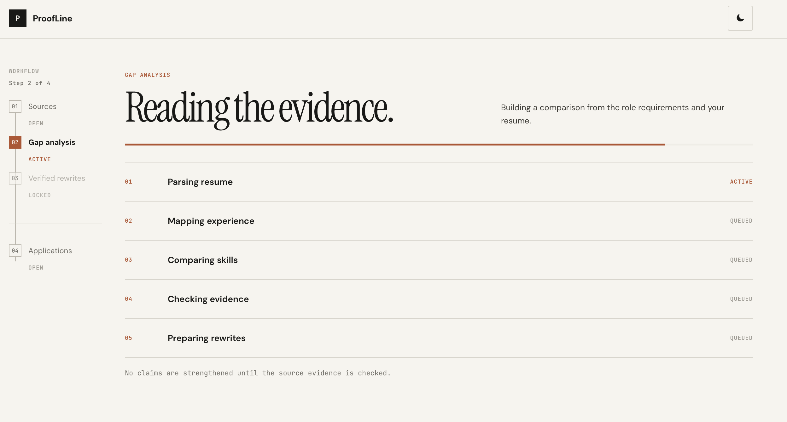
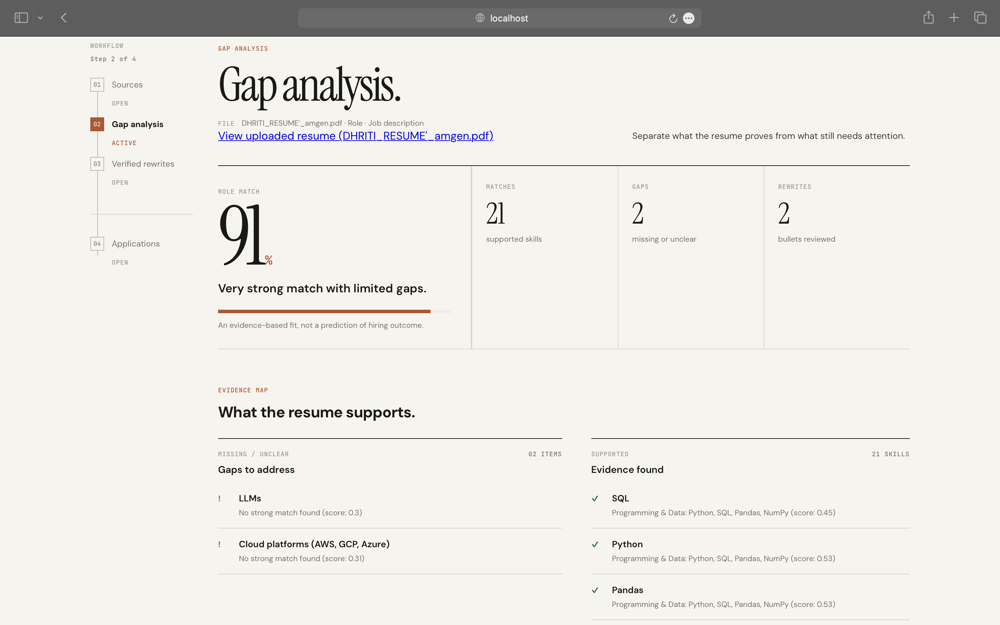
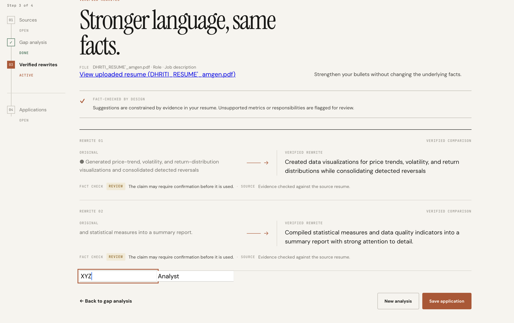
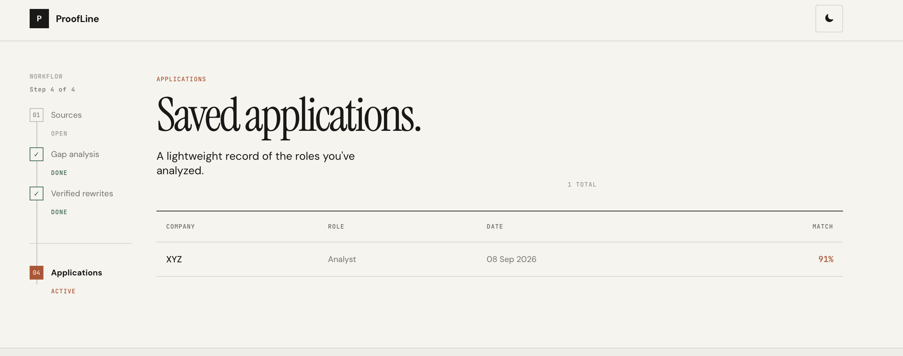

# ProofLine

**Find what your resume is missing for a job, and fix it without lying about it.**

ProofLine compares a resume against a job description, shows exactly which requirements are covered and which aren't, and rewrites weak bullet points to better match the job's language. Every rewrite is independently fact-checked by a second AI pass before it's shown, so it can improve wording but can't quietly invent a metric, a tool, or an achievement that isn't actually in the original resume.

---

## 1. Key Features

1. **Resume parsing** — reads PDF and DOCX resumes and structures them into sections (experience, projects, skills, education).
2. **Job description parsing** — extracts skills, responsibilities, and requirements from raw pasted text using structured LLM output.
3. **Gap analysis** — matches resume content against JD requirements using keyword overlap plus semantic similarity, producing a transparent match score with evidence for every match.
4. **Verified rewrites** — generates improved bullet points for weak matches, then runs a second, independent model pass that checks every claim in the rewrite against the original resume text and flags anything unsupported.
5. **Application tracker** — saves which resume version, role, and company were used for each application.

---
## 2. Screenshots

### Analysis pipeline

ProofLine takes the resume and job description through a structured analysis pipeline — parsing the sources, mapping experience, comparing skills, checking supporting evidence, and preparing rewrites.



### Evidence-based gap analysis

A real analysis run showing a **91% role match**, with **21 supported skills** and **2 missing or unclear requirements**. Each match is backed by evidence from the uploaded resume.



### Verified rewrites

ProofLine strengthens resume bullets while preserving the underlying facts. Each rewrite is compared against the source resume and given a factuality verdict — including **REVIEW** when a claim needs confirmation rather than being silently approved.



### Application tracking

Completed analyses can be saved with the **company, role, date, and match score**, giving users a lightweight record of the applications they've analyzed.



---

---

## 3. Why the guardrail exists

An LLM asked to "rewrite this bullet to sound stronger" has no built-in incentive to stay factual. It will reach for a plausible-sounding metric because that's what a strong bullet point usually looks like in its training data, not because that metric is true.

ProofLine treats rewriting and verification as two separate jobs, run by two independent model calls. The rewriter is constrained by explicit rules against inventing numbers, tools, or scale. The verifier only ever sees the original text and the candidate rewrite, decomposes the rewrite into individual factual claims, and checks each one against the source. A single model checking its own output has no reason to catch its own mistake — a second, separate pass does.

This was tested against a 34-case hand-built dataset spanning honest rewrites, fabricated metrics, fabricated tools, and deliberately ambiguous cases. On the core safety-relevant distinction — does a rewrite contain a fabrication or not — the guardrail scored **100% precision and 100% recall**. The one place it fell short on the first pass was an intermediate "needs review" category for genuinely ambiguous phrasing, which it barely used at first. That was traced to a prompt instruction overpowering the model's willingness to use the softer label, and fixed by adding contrasting examples — visible above in the actual REVIEW verdicts rather than a blanket pass or fail.

---

## 4. Tech Stack

| Layer | Technology |
|---|---|
| Frontend | React (Vite), plain CSS |
| Backend | FastAPI |
| LLM | Google Gemini API |
| Semantic matching | sentence-transformers |
| Database | SQLite |
| Resume parsing | pdfplumber, python-docx |

**Deliberately not used:** RAG (no external corpus to retrieve from), LangChain or a vector database (the pipeline is five sequential calls, not enough to justify the abstraction), fine-tuning (prompting a general-purpose model already solves this), Docker (not needed at this scale).

---

## 5. Installation & Usage

### Prerequisites
- Python 3.10+
- Node.js 18+
- A free Gemini API key from [Google AI Studio](https://aistudio.google.com)

### 1. Clone the repo
```bash
git clone https://github.com/DhritiJindal13/ProofLine.ai.git
cd ProofLine.ai
```

### 2. Set up environment variables
```bash
cp .env.example .env
```
Add your Gemini API key to `.env`:
```
GEMINI_API_KEY=your_key_here
```

### 3. Start the backend
```bash
python3 -m venv venv
source venv/bin/activate
pip install -r requirements.txt
cd backend
uvicorn main:app --reload
```
Confirm it's running at `http://localhost:8000/health`.

### 4. Start the frontend
In a new terminal:
```bash
cd Frontend
npm install
npm run dev
```
Open `http://localhost:5173`, upload a resume, paste a job description, and click Analyze.

---

## 6. Project Structure

```
ProofLine.ai/
├── backend/           FastAPI app, main API endpoints
├── Frontend/          React app (Vite)
├── db/                SQLite database logic
├── pdf_test.py        Resume parsing
├── jd_parser.py       Job description parsing
├── guardrail.py       Claim-level factuality verification
├── rewrite_engine.py  Bullet rewrite generation
├── pipeline.py        Combined rewrite + verification flow
└── eval_dataset.py    Guardrail evaluation test cases
```

---

## 7. What Doesn't Work Yet

1. The similarity threshold is a relative signal tuned by inspecting real output, not a fixed formula — it occasionally lets a loose match through on compound requirements like "Python, JavaScript, or similar."
2. No OCR — only resumes with a real text layer are supported, not scanned images. A deliberate scope cut, not an oversight.
3. No full-resume regeneration — the tool surfaces gap analysis and verified rewrites; a person still decides what goes into the actual resume document.
4. The backend runs locally rather than on a hosted platform. The embedding step needs more memory than free-tier hosting typically allows.

---

## License

MIT
